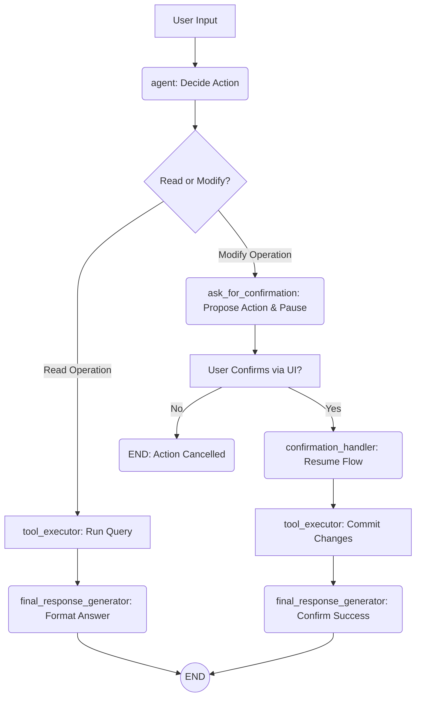

# Mini Agentic Bot (LangGraph + LangChain)

This project is a technical assignment for the Gen AI Internship at Mentox. It's a sophisticated, AI-powered project management assistant capable of interacting with multiple databases and performing **CRUD** (Create, Read, Update, Delete) operations via a natural language interface.

The agent features a crucial **human-in-the-loop (HITL)** confirmation step for all data modification operations (`Create`, `Update`, `Delete`), ensuring data integrity and user oversight.

## 🎥 Agentic Bot Demo  
Check out the demo video of my Agentic Bot here: [Watch Demo](https://drive.google.com/file/d/1URIaavymGp9LZWvTRgT7ww9vDySudo37/view?usp=drive_link)


---
## 🌟 Core Features

-   **Natural Language CRUD**: Manage users and tasks using conversational English.
-   **Multi-Database Interaction**: The agent seamlessly queries and relates data from two separate mock databases (`users.db` and `tasks.db`).
-   **Human-in-the-Loop (HITL)**: **Read** operations are executed instantly. All **Create, Update, and Delete** operations require explicit user confirmation before execution, fulfilling a key project requirement.
-   **Stateful Conversations**: The agent's memory, built with LangGraph, allows it to handle multi-step tasks like cross-table lookups (e.g., "What is Bob working on?").
-   **Dual Interface**:
    -   An interactive **Streamlit UI** for a rich, user-friendly chat experience.
    -   A **FastAPI** server that exposes the agent's functionality via a REST API.
-   **Containerized**: The entire application is dockerized for easy, one-command deployment.

---
## 🏗️ System Design & Architecture

### Technology Stack

| Component         | Technology / Library                                 | Purpose                                                           |
| ----------------- | ---------------------------------------------------- | ----------------------------------------------------------------- |
| **Orchestration** | **LangGraph** | To build the agent's stateful, cyclical, and conditional workflow.  |
| **AI Framework** | **LangChain** | To create and manage the agent's tools and LLM interactions.      |
| **LLM** | **Groq (Llama 3)** | For fast and accurate natural language understanding and SQL generation. |
| **Web Interface** | **Streamlit** | To provide an interactive chat UI for demonstration.              |
| **REST API** | **FastAPI** | To expose the agent's functionality via a standard REST endpoint. |
| **Database** | **SQLite** | For lightweight, file-based mock databases.                       |
| **Containerization** | **Docker** | To ensure a reproducible and easily deployable environment.       |

### LangGraph Agent Workflow

The agent operates as a state machine, with specific paths for reading data versus modifying it. The Human-in-the-Loop (HITL) confirmation is a critical conditional branch in the graph.


-   **Read Path**: A direct flow from intent to tool execution to response.
-   **Modify Path**: An interrupted flow that pauses at the `ask_for_confirmation` node, waits for user input ("yes/no"), and then resumes to either commit the change or cancel the action.

---

## 💬 Conversational Flow

The agent's logic is best understood by tracing two key conversation types: a direct data query and a modification request that requires user confirmation.

### Flow 1: Read Operation (e.g., "What is Bob working on?")

1.  **User Input**: The user asks a question to retrieve data.
2.  **Agent Node**: The LLM receives the input. It determines the user's intent is to read data and selects the most appropriate tool, in this case, `find_tasks_by_user(user_name='Bob')`.
3.  **Conditional Routing**: The graph sees that a "find" tool was selected and routes the flow directly to the `tool_executor`.
4.  **Tool Executor Node**: The `find_tasks_by_user` Python function is executed. It performs the necessary two-step SQL query: first to find Bob's ID in `users.db`, and then to find his tasks in `tasks.db`. The results are returned.
5.  **Final Response Generator Node**: This node receives the tool's output (the list of tasks). It calls the LLM with a prompt to format this data into a friendly, human-readable sentence.
6.  **End**: The final, formatted response is displayed to the user in the Streamlit UI.

### Flow 2: Modify Operation with HITL (e.g., "Create a task for Alice")

1.  **User Input**: The user makes a request to create, update, or delete data.
2.  **Agent Node**: The LLM understands the intent is to modify data. It selects the `DataModificationTool` and generates the required SQL `INSERT` statement.
3.  **Conditional Routing**: The graph sees that a modification tool was selected and routes the flow to the `ask_for_confirmation` node.
4.  **Ask for Confirmation Node**: This node takes the generated SQL and asks the LLM to create a simple summary (e.g., "I am about to create a new task..."). The graph then **pauses** and waits for human input.
5.  **Human in the Loop**: The user sees the summary in the UI and replies "yes" or "no".
6.  **Confirmation Handler Node**: The graph resumes from its saved state. This node receives the user's reply.
    -   If "no", the flow is routed directly to the end with a cancellation message.
    -   If "yes", the flow is routed to the `tool_executor`.
7.  **Tool Executor Node**: The `DataModificationTool` is executed, which commits the saved SQL `INSERT` statement to the database.
8.  **Final Response Generator Node**: This node is called with the context of the successful tool execution and the user's original request. It asks the LLM to generate a final success message (e.g., "Great, the task has been created!").
9.  **End**: The success message is displayed to the user.

---

## 🚀 Getting Started

### Prerequisites
-   Docker and Docker Compose must be installed and running.
-   You need a Groq API key.

### 1. Setup
Clone the repository and navigate into the project directory.

Create a `.env` file in the root of the project and add your Groq API key:
```
GROQ_API_KEY="gsk_YourApiKeyHere"
```

### 2. Run with Docker Compose
To build the images and run the application, use the following command. This will start the Streamlit UI and the FastAPI server.

```bash
docker-compose up --build
```
This command will:
1.  Build the Docker image for the application.
2.  Run the `setup_database.py` script inside the container to create the mock databases.
3.  Start the Streamlit and FastAPI servers.

### 3. Access the Application
-   **Streamlit Chat Interface**: Open your browser to **`http://localhost:8501`**
-   **FastAPI REST API Docs**: Access the interactive documentation at **`http://localhost:8000/docs`**

---
## 💻 Local Development (Without Docker)

1.  **Create a Virtual Environment:**
    ```bash
    python -m venv venv
    source vent/bin/activate  # On Windows use `venv\Scripts\activate`
    ```
2.  **Install Dependencies:**
    ```bash
    pip install -r requirements.txt
    ```
3.  **Create Databases:**
    Run the setup script once to create and populate the SQLite database files.
    ```bash
    python setup_database.py
    ```
4.  **Run the Applications:**
    You can run the Streamlit UI and FastAPI server in separate terminals.
    
    * **Terminal 1: Run Streamlit UI**
        ```bash
        streamlit run frontend/chat_ui.py
        ```
    * **Terminal 2: Run FastAPI Server**
        ```bash
        uvicorn backend.api:app --reload
        ```

---
## 🔧 Agent Tools & Capabilities

The agent's abilities are defined by a set of powerful, high-level tools. This approach is more robust than relying on the LLM to generate complex SQL for every query.

-   **`find_tasks_by_user(user_name: str)`**: A smart tool that performs the necessary two-step query to find a user's ID and then retrieve all tasks assigned to that ID.
-   **`find_users_by_team(team_name: str)`**: A tool to find all users belonging to a specific team, handling case-insensitivity at the database level.
-   **`DataModificationTool(query: str, db_name: str)`**: A specialized tool used only for `INSERT`, `UPDATE`, and `DELETE` operations. The agent generates the SQL for this tool, which then triggers the Human-in-the-Loop confirmation flow.
